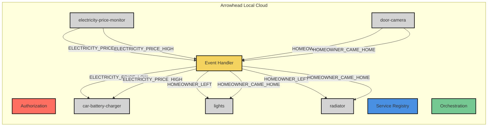

# System of System documentation

## Graph

## Table
| System                  | Type      | Service                         | Event Name                | Action                                    |
|-------------------------|-----------|----------------------------------|---------------------------|-------------------------------------------|
| **car-battery-charger** | Consumer  | `car-battery-charger-dummy`   | `ELECTRICITY_PRICE_LOW`   | Charge battery                            |
|                         |           |                                  | `ELECTRICITY_PRICE_HIGH`  | Stop charging action                                 |
| **door-camera**         | Provider  | `door-camera-dummy`             | `HOMEOWNER_LEFT`          | Sent when homeowner leaves                                |
|                         |           |                                  | `HOMEOWNER_CAME_HOME`     | Sent when homeowner comes home                                |
| **lights**              | Consumer  | `LightsController`              | `HOMEOWNER_LEFT`          | Turn off lights                           |
|                         |           |                                  | `HOMEOWNER_CAME_HOME`     | Turn on lights                            |
| **electricity-price-monitor** | Provider | `electricity-price-monitor-dummy` | `ELECTRICITY_PRICE_LOW`   | Sent when price is low                                |
|                         |           |                                  | `ELECTRICITY_PRICE_HIGH`  | Send when price is high                                |
| **radiator**            | Consumer  | `RadiatorController`            | `HOMEOWNER_LEFT`          | Turn off radiator                         |
|                         |           |                                  | `HOMEOWNER_CAME_HOME`     | Turn on radiator                          |
