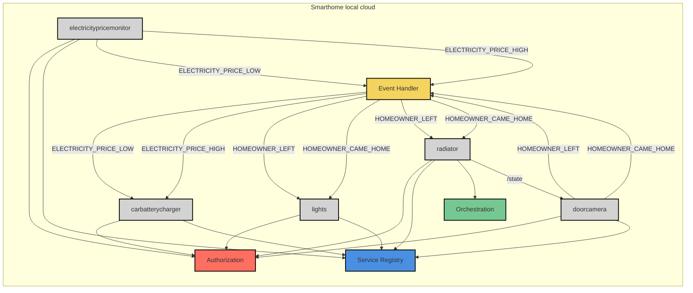

# System-of-System documentation (SoSD)

# System of Systems Overview
This document describes the SmartHome system, which is a PoC to demonstrate a smart energy-efficient home using the Arrowhead Framework in a local cloud. The system of systems (SoS) aims to both minimize energy usage and costs as well as making life more convenience for the homeowner. The PoC demonstrates this by automating home appliances and services based on predefined events such as when the owner leaves or enters the home. The SoS uses event-driven architecture to control heating, lighting and electric car charging based on the homeowner's presence and electricity prices.

The system contains five application systems: doorcamera, electricitypricemonitor, lights, radiator and carbatterycharger. The doorcamera publishes events when homeowner leaves or comes. The electricitypricemonitor publishes events when the electricity price is high or low. The lights subscribes to the events when a homeowner leaves or comes home and then switches the lights on/off accordingly to save energy. The radiator subscribes to the events when a homeowner leaves or comes home and then turns the radiator on/off accordingly to save energy. The carbatterycharger subscribes to the events when electricity price is high or low and then turns charges the car / or stops charging the car accordingly to save costs.

## Figure 1. System of systems local cloud diagram

## Systems
| System                  | Type      | Service                         | Event Name                | Action                                    |
|-------------------------|-----------|----------------------------------|---------------------------|-------------------------------------------|
| **[carbatterycharger](/docs/carbatterycharger)** | Consumer  | none   | `ELECTRICITY_PRICE_LOW`   | Charge battery                            |
|                         |           |                                  | `ELECTRICITY_PRICE_HIGH`  | Stop charging action                                 |
| **[doorcamera](/docs/doorcamera)**         | Provider  | `door-camera-dummy`             | `HOMEOWNER_LEFT`          | Sent when homeowner leaves                                |
|                         |           |                                  | `HOMEOWNER_CAME_HOME`     | Sent when homeowner comes home                                |
|                         |           | [get-state](/docs/doorcamera/readme.md#get-state)             |          | Returns current state of homeowner                                |
| **[lights](/docs/lights)**              | Consumer  | none              | `HOMEOWNER_LEFT`          | Turn off lights                           |
|                         |           |                                  | `HOMEOWNER_CAME_HOME`     | Turn on lights                            |
| **[electricitypricemonitor](/docs/electricitypricemonitor)** | Provider | `electricity-price-monitor-dummy` | `ELECTRICITY_PRICE_LOW`   | Sent when price is low                                |
|                         |           |                                  | `ELECTRICITY_PRICE_HIGH`  | Send when price is high                                |
| **[radiator](/docs/radiator)**            | Consumer  | none            | `HOMEOWNER_LEFT`          | Turn off radiator                         |
|                         |           |                                  | `HOMEOWNER_CAME_HOME`     | Turn on radiator                          |
| **[EventHandler](https://github.com/arrowhead-f/core-java-spring/blob/aitia-docs/eventhandler)**            | Support system  |    n/a        |           |                          |
| **[ServiceRegistry](https://github.com/arrowhead-f/core-java-spring/blob/aitia-docs/serviceregistry)**            | Core system  | n/a            |           |                          |
| **[Authorization](https://github.com/arrowhead-f/core-java-spring/blob/aitia-docs/authorization)**            | Core system  | n/a            |           |                          |

## Security
The security of Eclipse Arrowhead - and therefore the security of each system - is relying on X.509
certificate trust chains. The Arrowhead trust chain consists of three level:
- Master certificate: arrowhead.eu
- Cloud certificate: testcloud2.aitia.arrowhead.eu
- Client certificate: my-client.testcloud2.aitia.arrowhead.eu
- Example: lights.testcloud2.aitia.arrowhead.eu

The systems sets up a filter that is responsible for validating whether the received HTTPS requests and/or events
are coming from one of the local cloud’s clients based on its certificate.

## Figure 2. Screenshot of system running

